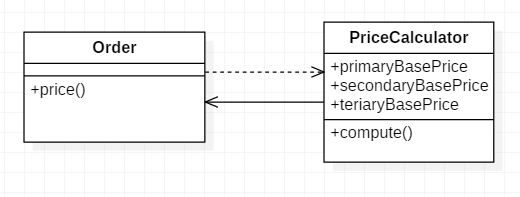

# 메서드를 메서드 객체로 변환

지역변수 때문에 [메서드 추출](1.ExtractMethod.md)을 적용할 수 없는 긴 메서드가 있을 땐
*그 메서드 자체를 객체로 전환해서 모든 지역변수를 객체의 필드로 만들자
그런 다은 그 메서드를 객체안의 여러 메서드로 쪼개면 된다.*

* 메서드 분해를 어렵게 만드는 것은 지역변수다. 지역변수가 많으면 메서드를 쪼개기 힘들 수 있다.  
[임시번수를 메소드 호출로 전환](4.ReplaceTempWithQuery.md)을 적용하면 이런 어려움이 어느정도 해소되지만, 분해가 필요한 메서드를 분해 할 수 없을 떄도 있다. 이럴 땐 메서드 객체로 수정해야 한다.
* [메서드를 메서드 객체로 변환](4.ReplaceTempWithQuery.md) 기법을 적용하면 모든 지역변수가 메서드 객체의 속성이 된다.  
그러면 그 객체에 [메서드 추출](1.ExtractMethod.md)을 적용해서 원래의 메서드를 쪼개어 여러 개의 추가 메서드를 만들면 된다.


---

## 예제 코드

* before
```java
	class Order...
		double price(){
			double primaryBasePrice;
			double secondaryBasePrice;
			double tertiaryBasePrice;
			// 긴 계산 코드
			...
		}
```

* after  

```java
	public int price(){
		return new PriceCalculator(this).compute();
	}
```