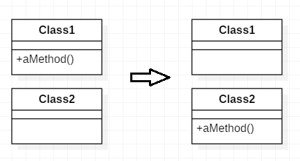

# 메서드 이동

메서드가 자신이 속한 클래스보다 다름 클래스의 기능을 더 많이 이용할 땐
*그 메서드가 제일 많이 이용하는 클래스 안에서 비슷한 내용의 새 메서드를 작성하라.
기존 메서드는 간단한 대리 메서드로 전환하든지 아예 삭제하라*

* 클래스에 기능이 너무 많거나 클래스가 다른 클래스와 과하게 연동되어 의존성이 지나칠 때는 메서드를 옮기는 것이 좋다.
* 메서드를 옮기면 클래스가 간결해지고 여러 기능을 더 명확히 구현할 수있다.

---

## 예제

