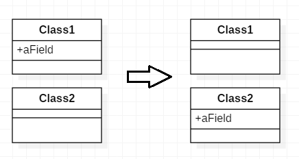

# 필드 이동

어떤 필드가 자신이 속한 클래스보다 다른 클래스에서 더 많이 사용될 때는
*대상 클래스 안에 새 필드를 선언하고 그 필드 참조 부분을 전부 새 필드로 참조로 수정하자.*

* 한 클래스에서 다른 클래스로 상태와 기능을 옮기는 것은 리팩토링의 기본이다.
* 어떤 필드가 자신이 속한 클래스보다 다른 클래스에 있는 메서드를 더 많이 참조해서 정보를 이용한다면 그 필드를 옮기는 것을 생각해 보자.  인터페이스에 따라 메서드를 옮기는 방법을 사용할 수도 있다.  
그러나 메서드의 현재 위치가 적잘하다고 판단되면 필드를 옮기자
* [클래스 추출](ExtractClass.md)을 실시하는 중에서도 필드를 옮기는 기법이 수반된다. 이럴 떈 필드가 우선이고 메서드는 다음이다.

---

## 예제

