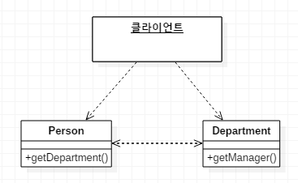
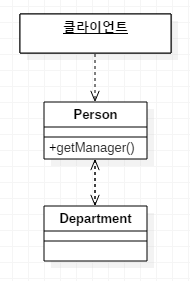

# 대리 객체 은폐

클라이언트가 객체의 대리 클래스를 호출할 땐
*대리 클래스를 감추는 매서드를 서버에 작성하자.*

* 객체를 캡슐화하면 무언가를 변경할 때 그 변화를 전달해야 할 객체가 줄어들어 변경하기 쉬워진다.
* 서버의 일부 클라이언트나 모든 클라이언트에 [대리 객체 은폐](5.HideDelegate.md)를 실시하는것이 좋을때도 있다.
* 모든 클라이언트를 대상으로 대리 객체를 감출 경우에는 서버의 인터페이스에서 대리 객체에 대한 모든 부분을 삭제해도 된다.  
* 대리 객체를 감추는 간단한 위임 메서드를 생성하면 클라이언트에는 영향을 주지 않는다.  

---

## 예제
* before  

* after  
