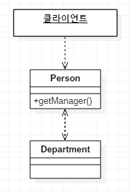
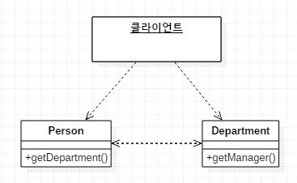

# 과잉 중개 메서드 제거

클래스에 자잘한 위임이 너무 많을 땐
*대리 객체를 클라이언트가 직접 호출하게 하자.*

* [대리 객체 은폐](5.HideDelegate.md)의 단정은 클라이언트가 대리 객체의 새기능을 사용해야 할 때마다 서버의 간단한 위임 메서드를 추가해야 한다는 점이다.
서버 클래스는 그저 중개자에 불과하므로, 이때는 클라이언트가 대리 객체를 직접 호출하게 해야 한다.
* 은폐의 적절한 정도를 알기란 어렵다. [대리 객체 은폐](5.HideDelegate.md) , [과잉 중개 메서드 제거](6.RemoveMiddleMan.md)를 실시 할때 시간을 두고 적절히 리펙토링 하자.

---

## 예제
* before  

* after  
