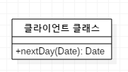
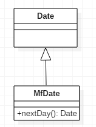

# 국소적 상속확장 클래스 사용

사용중인 서버 클래스에 여러개의 메서드를 추가해야 하는데 클래스를 수정할 수 없을 땐  
*새 클래스를 작성하고 그 안에 필요한 여러 개의 메서드를 작성하자
이 상속 확장 클래스를 원본 클래스의 하위클래스나 래퍼 클래스로 만들자.*

* 필요한 메서드가 한두개 일 때는 [외래 클래스에 메서드 추가](7.IntroduceForeignMethod.md)기법을 실시하면 된다.
하지만 메서드 수가 세개 이상이면 그 기법으론 무리다.
* 하위클래스화와 래퍼화를 실시하는것이 [국소적 상속확장 클래스 사용](8.IntroduceLocalExtension.md)이다.

---

## 예제
* before  

* after  
