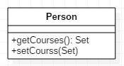
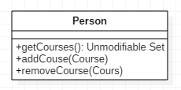

# 컬렉션 캡슐화

메서드가 컬렉션을 반환할 땐
*그 메서드가 읽기전용 뷰를 반환하게 수정하고 추가 메서드와 삭제 메서드를 작성하자.*

* 컬렉션은 다른 종류의 데이터와는 약간 다른 getter/setter 방식을 사용해야 한다.
* getter 메서드는 컬렉션 객체 자체를 반환해서 안 된다. 왜냐하면 컬렉션 참조 부분이 컬렉션의 내용을 조작해도 그 컬렉션이 든 클래스는 무슨 일이 일어나는지 모르기 때문이다.  
이로인해 컬렉션 참조 코드에게 그 객체의 데이터 구조가 지나치게 노출된다.   
값이 여러 개인 속성을 읽는 getter 메서드는 컬렉션 조작이 불가능한 형식을 반환하고 불필요하게 자세한 컬렉션 구조 정보는 감춰야 한다.

---

## 예제
* before  

* after  

