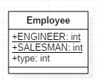
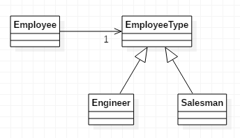

# 분류 부호를 상태/전략 패턴으로 전환

분류 부호가 클래스의 기능에 영향을 주지만 하위클래스로 전환할 수 없을 땐
*그 분류 부호를 상태 객체로 만들자.*

* 이 기법은 [분류 부호를 하위클래스로 전화](13.ReplaceTypeCodeWithSubclasses.md)과 비슷하지만, 분류 부호가 객체 수명주기 동안 변할 떄나  
다른 이유로 하위클래스로 만들 수 없을 때 사용한다.
* 이 기법은 상태 패턴이나 전략 패턴 중 하나를 사용한다.
* 상태 패턴과 전략 패턴은 서로 비슷하므로 사용하는 리팩토링 기법도 값다. 득정 상황에 더 잘 맞는 패턴을 선택하자.
* [조건문을 재정의로 전화](TODO)으로 하나의 알고리즘을 단순화해야 할 때는 전략이 더 적절하며,  
상태별 데이터를 이동하고 객체를 변화하는 상태로 생각할 때는 상태 패턴이 더 적절하다.

---

## 예제
* before  

* after  

