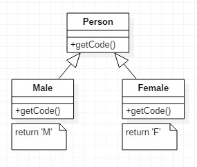

# 하위클래스를 필드로 전환

여러 하위클래스가 상수 데이터를 반환하는 메서드만 다를 꺤
*각 하위클래스의 메서드를 상위클래스 필드로 전환하고 하위클래스는 전부 삭제하자.*

* 상수 메서드가 유용하긴 해도, 하위클래스를 상수 메서드로만 구성한다고 해서 그만큼 효용성이 커지는 것은 아니다.  
상위 클래스 안에 필드를 넣고 그런 하위클래스는 완전히 삭제하면 된다. 그렇게 하면 하위클래스의 불필요한 복잡함도 사라진다.

---

## 예제
* before  

* after  

