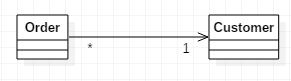
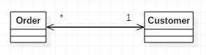

# 클래스의 단방향 연결을 양방향으로 전환

두 클래스가 서로의 기능을 사용해야 하는데 한 방향으로만 연결되어 있을 땐
*역 포인터를 추가하고 두 클래스를 모두 업데이트할 수 있게 접근 한정자를 수정하자.*

* 애초에 두 클래스를 설정할 때 한 클래스가 다른 클래스를 참조하게 해놓은 경우가 있을수 있다.  
나중에 참조되는 클래스를 사용하는 부분에서 그 클래스를 참조하는 객체들을 가져와야 할 수도있다. 즉, 포인터를 역방향으로 참조해야 한다.
* 이 방법은 까다로운 과정이 많아 익숙해질 떄까진 반드시 각종 테스트를 실시해야 한다.
* 이 리팩토링 기법은 역 포인터를 사용해서 양방향 연결을 구현한다. 연결 객체 등의 다른 방법을 사용하려면 다른 리팩토링 기법을 이용해야 한다.

---

## 예제
* before  

* after  

