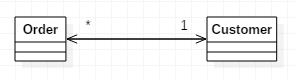

# 클래스의 양방향 연결을 단방향으로 전환

두 클래스가 양방향으로 연결되어 있는데 한 클래스가 다른 클래스의 기능을 더 이상 사용하지 않게 됐을 땐
*불필요한 방향의 연결을 끊자* 

* 양방향 연결은 쓸모가 많지만 개가가 따른다. 즉, 양발향 연결을 유지하고 객체가 적절히 생성되고 제거되는지 확인하는 복잡함이 더해진다.
* 양방향 연결이 많으면 참조가 삭제되지 않아 남아 떠도는 좀비 객체가 발생하기도 쉽다.
* 양방향 연결로 인해 두 클래스는 서로 종속된다. 한 클래스를 수정하면 다른 클래스도 변경된다.  
종속성이 많으면 시스템의 결합력이 강해져서 사소한 수정에도 예기치 못한 각종 문제가 발생한다.
* 양방향 연결은 꼭 필요할 때만 사용해야 한다. 양방향 연결이 더 이상 쓸모가없다고 판단되면 불필요한 말단의 연결을 차단하자.

---

## 예제
* before  

* after  

